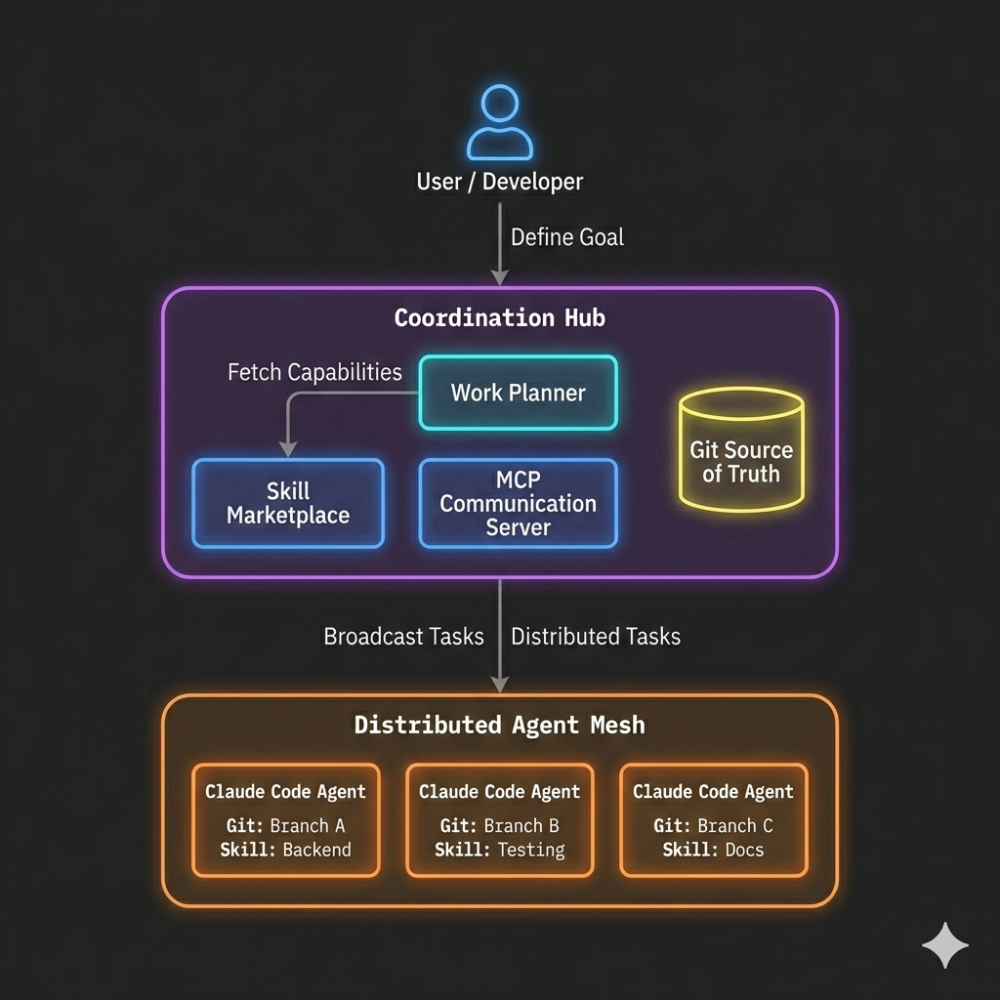

# ClaudeVN

**The first virtual network for distributed AI collaboration.**

[](https://github.com/trueorc/claudevn)
[](LICENSE)
[](docs/design/architecture/v1.0-architecture.md)

---

## AI Agents That Actually Work Together

Most AI tools run one model, one task, one prompt at a time. When people try to coordinate multiple agents, they end up building fragile pipelines — step 1 feeds step 2, and everything breaks when reality doesn't match the plan.

**ClaudeVN takes a different approach: distributed AI compute with real collaboration.**

Claude Code is already the most capable AI coding tool available. ClaudeVN is the networking layer that connects multiple Claude Code instances into a distributed compute network — where agents collaborate on real goals and produce real results: branches, pull requests, tested code.

Not scripted handoffs. Genuine AI collaboration where agents share context, adapt to blockers, and self-organize around the work.

```
Traditional AI Automation             ClaudeVN
━━━━━━━━━━━━━━━━━━━━━━━━━━━━━━━━━━━━━━━━━━━━━━━━━━━━━━━━━━━━━━━━━━━━━

   Prompt → Response → Done              ┌───────────────────────┐
                                         │    Your Goals         │
   One model. One task.                  └───────────┬───────────┘
   Scale means "call it again."                      │
                                         ┌───────────▼───────────┐
                                         │  Distributed Network  │
                                         │  of Claude Code       │
                                         │  instances that       │
                                         │  collaborate, adapt,  │
                                         │  and ship code        │
                                         └───────────────────────┘
```

---

## What Makes This Different

| | Traditional AI Tools | ClaudeVN |
|---|---|---|
| **Compute** | Single model, single task | Distributed network of Claude Code instances |
| **Coordination** | Scripted pipelines | Real-time collaboration through shared context |
| **State** | Ephemeral prompts | Git branches — persistent, auditable, mergeable |
| **Output** | Text responses | Tested code, pull requests, merged branches |
| **Scaling** | Call the API more | Add machines to the network |

---

## How It Works

### 1. You define goals

Describe what you want in plain language. ClaudeVN interprets your intent and breaks it into concrete tasks.

### 2. Agents pick up work

Claude Code agents on the network claim tasks, create branches, and start building. Each agent brings the right skills for the job.

### 3. Agents collaborate

This is the part that's new. Agents share context, coordinate dependencies, and adapt when things change. Blocked on one task? Other agents keep moving. New requirement? The work plan adjusts.

### 4. Results ship

Finished work becomes pull requests. Code is reviewed, tested, and merged — with a full audit trail in Git.

---

## The Architecture

Claude Code is the engine. ClaudeVN is the network.

The system has two tiers: a **coordination hub** that manages work, and **Claude Code agents** that do the work. ClaudeVN doesn't replace Claude Code — it multiplies it.

<p align="center">

</p>

**Coordination Hub** manages goals, distributes work, hosts the Git repository, and provides the communication layer (MCP) that connects every agent on the network.

**Agents** are full Claude Code environments. Each agent connects to the hub, picks up tasks, and works autonomously — coordinating with other agents through the shared network.

---

## Key Capabilities

### Distributed AI Compute

Scale by adding agents to the network. Each agent is a complete Claude Code instance with full reasoning capabilities — not a thin wrapper or script runner.

### Git-Native Workflow

All work happens in Git. Every task is a branch, every result is a pull request. You get parallel work, conflict resolution, and complete history — using tools your team already knows.

### Skill Composition

Define agent capabilities with simple skill definitions. Mix and match skills to create specialized workers — a code reviewer, a test writer, a debugger — without building custom integrations.

### Real-Time Coordination

Agents communicate through the Model Context Protocol (MCP). They report progress, flag blockers, request reviews, and share context — enabling genuine collaboration, not just sequential handoffs.

---

## Your Network, Your Rules

ClaudeVN isn't a hosted service — it's infrastructure you own. Think of it like a private network, but for AI agents instead of computers.

### For teams and hobbyists

Run the hub on your machine. Connect your laptop, a friend's desktop, and a cloud instance. Manage everything from your phone. Every device you add is another AI agent on the network — no special infrastructure beyond what's already on your desk.

```
You (phone)  →  Hub (your machine)  →  Your laptop
                                    →  Friend's desktop
                                    →  Cloud VM
```

### For organizations

Deploy a private compute network across your infrastructure. Control which agents access which resources. Route sensitive work to secure nodes. Scale AI collaboration across teams, regions, and projects — with the same audit trails and access controls at every layer.

```
Dashboard  →  Hub (your infra)  →  Team A agents
                                →  Team B agents
                                →  EU region nodes
                                →  US region nodes
```

**Same protocol. Same tools. The only thing that changes is how many machines are on the network.**

---

## Why ClaudeVN

**Ship more.** Multiple AI agents working in parallel means more gets done — and it's real work: branches, tests, pull requests.

**Stay in control.** Everything flows through Git. You see every branch, every commit, every PR. Full audit trail, full rollback capability.

**Scale simply.** Need more capacity? Add machines to the network. Need less? Shut them down. Work scales with the network.

**Own your compute.** This is your private network. You decide who's on it, what they can access, and where it runs. No data leaving your perimeter.

**Use what you know.** Built on Claude Code, Git, and Redis. ClaudeVN extends tools you already use — no new paradigms to learn, no vendor lock-in, no proprietary runtimes.

---

## Getting Started

### Prerequisites

- Git
- Redis
- Claude Code CLI

### Quick Start

```bash
# Clone the repository
git clone https://github.com/trueorc/claudevn.git
cd claudevn

# Start with Docker Compose
docker compose up

# Coordination hub available at http://localhost:8002
```

### Project Structure

```
claudevn/
├── serving/                 # Coordination hub
│   ├── git/                 # Git infrastructure
│   ├── mcp/                 # Communication server
│   ├── services/            # Core services
│   └── frontend/            # Monitoring UI
├── marketplace/             # Skill marketplace service
├── compute/                 # Agent infrastructure
├── docs/
│   ├── design/
│   │   ├── architecture/    # System architecture
│   │   └── specifications/  # Component specs
│   └── guides/              # Setup and workflow guides
└── CLAUDE.md                # Project configuration
```

---

## Documentation

### Guides

| Document | Description |
|----------|-------------|
| [Getting Started](docs/getting-started.md) | Installation, setup, and first steps |
| [Architecture Overview](docs/architecture-overview.md) | System architecture and data flow |
| [MCP Tools Reference](docs/mcp-tools-reference.md) | Agent communication tools and examples |
| [Skill Authoring Guide](docs/skill-authoring-guide.md) | Creating custom skills for agents |
| [Configuration Reference](docs/configuration-reference.md) | All environment variables and settings |
| [Troubleshooting](docs/troubleshooting.md) | Common issues and solutions |

### Design Specifications

| Document | Description |
|----------|-------------|
| [System Architecture (v1.0)](docs/design/architecture/v1.0-architecture.md) | Detailed internal architecture document |
| [Git Infrastructure](docs/design/specifications/git-infrastructure.md) | Git server, hooks, PR queue |
| [MCP Tools Spec](docs/design/specifications/mcp-tools.md) | MCP protocol specification |
| [Skill Marketplace Spec](docs/design/specifications/skill-marketplace.md) | Skill marketplace design |
| [Worktree Workflow](docs/guides/worktree-workflow.md) | How agents use Git worktrees |

---

## Current Status

**Version 1.0.0** — Architecture Redesign

| Component | Status |
|-----------|--------|
| Architecture & specifications | Complete |
| Coordination hub (Serving) | In Progress |
| Skill marketplace | In Progress |
| Agent integration | Planned |

---

## Contributing

ClaudeVN is in active development. We welcome:

- **Code contributions** to the coordination hub and agent integration
- **Skill definitions** for new agent capabilities
- **Documentation** improvements and guides
- **Feedback** on the architecture and approach

See `CONTRIBUTING.md` for guidelines.

---

## License

AGPL-3.0 License — See `LICENSE` file.

---

<p align="center">
<strong>ClaudeVN</strong> — True Orchestration<br>
<em>The networking layer for distributed AI collaboration</em>
</p>
